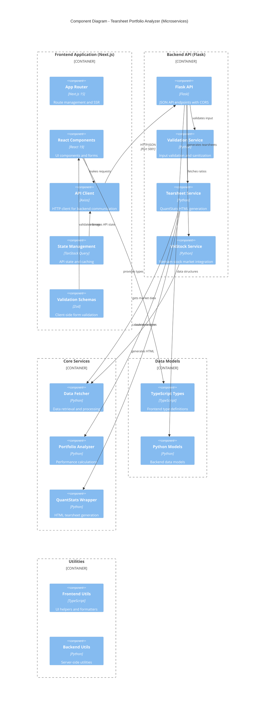

# Component Architecture

## Overview

The Tearsheet Portfolio Analyzer follows a modern **microservices architecture** with complete separation between frontend and backend. The system is organized as a Next.js frontend application communicating with a Flask API backend, promoting scalability, maintainability, and independent deployment.

## Architectural Patterns

### Microservices Architecture
- **Frontend Service**: Next.js 15 application (Port 3000)
- **Backend Service**: Flask API server (Port 5001)
- **Independent Deployment**: Each service can be deployed separately
- **API-First Design**: Communication via JSON REST APIs

### Frontend Patterns (Next.js)
- **App Router**: Next.js 15 App Router for server-side rendering
- **React Server Components**: Enhanced performance and SEO
- **Client-Side State Management**: TanStack Query for API state
- **TypeScript**: Full type safety throughout the frontend

### Backend Patterns (Flask)
- **API-Only Design**: JSON-only endpoints with CORS support
- **Service Layer**: Business logic orchestration
- **Repository Pattern**: Data access abstraction
- **Dependency Injection**: Service composition at startup

## Component Structure

## Layer Details

## Frontend Layer (Next.js Application)

### Next.js App Router (`frontend/src/app/`)
- **Responsibilities**:
  - Server-side rendering and static generation
  - Route management and navigation
  - SEO optimization and metadata
  - Client-side hydration

- **Key Routes**:
  - `/` - Main portfolio analysis page
  - API routes handled by backend

### React Components (`frontend/src/components/`)
- **Core Components**:
  - `PortfolioForm.tsx` - Portfolio input form with validation
  - `QuantStatsTearsheet.tsx` - HTML tearsheet display
  - UI components with TypeScript and Tailwind CSS

### API Client (`frontend/src/lib/api.ts`)
- **Responsibilities**:
  - HTTP client configuration (Axios)
  - API request/response handling
  - Error handling and retry logic
  - TypeScript integration

- **Key Methods**:
  - `generateTearsheet()` - Portfolio tearsheet generation
  - `validatePortfolio()` - Input validation
  - `fetchRatios()` - Financial ratios retrieval

## Backend Layer (Flask API)

### Flask API Server (`backend/api.py`)
- **Responsibilities**:
  - JSON API endpoints with CORS support
  - Request routing and middleware
  - Error handling and HTTP responses
  - Authentication and security headers

- **Key Endpoints**:
  - `GET /api/health` - Health check endpoint
  - `POST /api/tearsheet` - Generate QuantStats HTML tearsheet
  - `POST /api/validate` - Portfolio input validation
  - `POST /api/ratios` - Financial ratios analysis

### Backend Service Layer (`backend/src/services/`)

#### Validation Service
- **Purpose**: Input validation and sanitization
- **Key Methods**:
  - `validate_symbols()` - Stock symbol validation
  - `validate_weights()` - Portfolio weight validation
  - `validate_capital()` - Capital amount validation
  - `validate_date_range()` - Date range validation
  - `validate_portfolio_form()` - Complete form validation

#### VNStock Service  
- **Purpose**: Vietnam stock market data integration
- **Key Methods**:
  - `fetch_financial_ratios()` - Individual stock ratios
  - `fetch_multiple_ratios()` - Batch ratio processing
  - `get_fundamental_summary()` - Key metrics summary
  - `export_ratios_to_excel()` - Excel export functionality

### Backend Core Layer (`backend/src/core/`)

#### Data Fetcher
- **Purpose**: Centralized data retrieval and processing
- **Key Methods**:
  - `fetch_historical_data()` - Historical price data
  - `get_close_prices()` - Extract closing prices
  - `validate_data()` - Data quality checks

#### Portfolio Analyzer
- **Purpose**: Portfolio performance calculations
- **Key Methods**:
  - `calculate_portfolio_returns()` - Return calculations
  - `calculate_performance_metrics()` - Risk metrics
  - `validate_portfolio()` - Portfolio validation
  - `get_portfolio_summary()` - Summary statistics

### Data Models

#### Frontend Types (`frontend/src/types/`)
- **TypeScript Interfaces**:
  - `PortfolioFormData` - Form input structure
  - `TearsheetResponse` - API response types
  - `ValidationResponse` - Validation result types
  - Full type safety across React components

#### Backend Models (`backend/src/models/`)

#### Stock Model
- **Attributes**: symbol, weight, name, sector
- **Validation**: Weight bounds, symbol format
- **Methods**: Post-initialization validation

#### Portfolio Model
- **Attributes**: stocks, capital, date range, metadata
- **Validation**: Weight sum, date range, capital amount
- **Methods**: Allocation calculation, serialization

#### Portfolio Analysis Model
- **Attributes**: portfolio, returns data, metrics
- **Methods**: Summary statistics, serialization

### Utilities

#### Frontend Utils (`frontend/src/lib/`)
- **Utilities**:
  - Form validation schemas (Zod)
  - Date and currency formatters
  - API configuration and types
  - UI helper functions

#### Backend Utils (`backend/src/utils/`)

#### Exception Handling
- **Custom Exceptions**:
  - `ValidationError` - Input validation failures
  - `DataFetchError` - Data retrieval issues
  - `AnalysisError` - Calculation problems
  - `PortfolioError` - Portfolio-specific errors

#### Helper Functions
- **Categories**:
  - Logging setup and configuration
  - Currency and percentage formatting
  - Date calculations and utilities
  - Data structure manipulation

#### Constants
- **Configuration Values**:
  - Validation limits and tolerances
  - Date formats and patterns
  - Error messages and templates
  - Default values and thresholds

## Data Flow

### Modern Tearsheet Flow (Next.js + Flask)
1. **User Input**: Form submission in Next.js frontend
2. **Client Validation**: Zod schema validation in React
3. **API Request**: HTTP POST to Flask backend `/api/tearsheet`
4. **Server Validation**: Python validation service processes input
5. **Data Fetching**: VNStock API retrieval of market data
6. **Portfolio Analysis**: QuantStats generates complete HTML tearsheet
7. **JSON Response**: HTML content returned to frontend
8. **Client Rendering**: React displays tearsheet using `dangerouslySetInnerHTML`

### Cross-Origin Communication
- **CORS Configuration**: Flask backend enables cross-origin requests
- **Environment Variables**: API URLs configured via environment
- **Error Handling**: Comprehensive error boundaries and user feedback
- **Loading States**: Progressive UI updates during analysis

## Configuration Management

### Environment Configuration
- **Base Configuration**: Common settings across environments
- **Development Configuration**: Debug mode, local settings
- **Production Configuration**: Optimized for deployment

### Configuration Loading
- Environment-specific settings loaded at startup
- Environment variables override configuration files
- Validation of required configuration values

## Error Handling Strategy

### Frontend Error Handling
- **React Error Boundaries**: Component-level error isolation
- **API Error Handling**: TanStack Query error management
- **Form Validation**: Real-time validation with user feedback
- **Loading States**: Progressive enhancement during API calls

### Backend Error Handling
- **Exception Hierarchy**: Structured error classification
- **API Error Responses**: Consistent JSON error format
- **Logging**: Comprehensive error tracking and monitoring
- **Graceful Degradation**: Partial results when possible

### Cross-Service Error Handling
- **Network Errors**: Retry logic and offline handling
- **Timeout Management**: Request timeout configuration
- **Service Unavailability**: Fallback mechanisms
- **User Communication**: Clear error messages and guidance

## Testing Architecture

### Frontend Testing
- **Component Testing**: React component testing with Jest/Testing Library
- **Type Checking**: TypeScript compilation and type validation
- **Lint Testing**: ESLint and Prettier code quality checks
- **API Integration**: Mock API responses for component testing

### Backend Testing
- **Unit Testing**: Individual service and model testing
- **API Testing**: HTTP endpoint testing with test client
- **Integration Testing**: Full workflow testing with real data
- **External API Testing**: VNStock integration validation

### End-to-End Testing
- **Full Stack Testing**: Complete user workflow validation
- **Cross-Browser Testing**: Frontend compatibility testing
- **Performance Testing**: API response time and frontend rendering
- **Error Handling**: Comprehensive error scenario testing

## Security Considerations

### Frontend Security
- **XSS Protection**: React's built-in XSS protection
- **Content Security Policy**: Strict CSP headers
- **Input Sanitization**: Zod validation schemas
- **HTTPS Enforcement**: Secure transport layer

### Backend Security
- **CORS Configuration**: Proper cross-origin policies
- **Input Validation**: Multi-layer validation (client + server)
- **SQL Injection Prevention**: Parameterized queries
- **API Security**: Rate limiting and authentication headers

### Data Privacy
- **Stateless Architecture**: No permanent user data storage
- **Temporary File Cleanup**: Generated tearsheets cleaned up
- **Environment Variables**: Secure API key management
- **Session Isolation**: Independent user sessions

## Deployment Architecture

### Development Environment
- **Dual Server Setup**: Frontend (3000) + Backend (5001)
- **Hot Reloading**: Next.js dev server with Turbopack
- **API Proxy**: Environment-based API URL configuration
- **Debug Mode**: Enhanced logging and error reporting

### Production Environment
- **Container Deployment**: Docker containerization
- **Reverse Proxy**: Nginx for static assets and routing
- **Environment Separation**: Production-specific configurations
- **Health Monitoring**: API health checks and monitoring