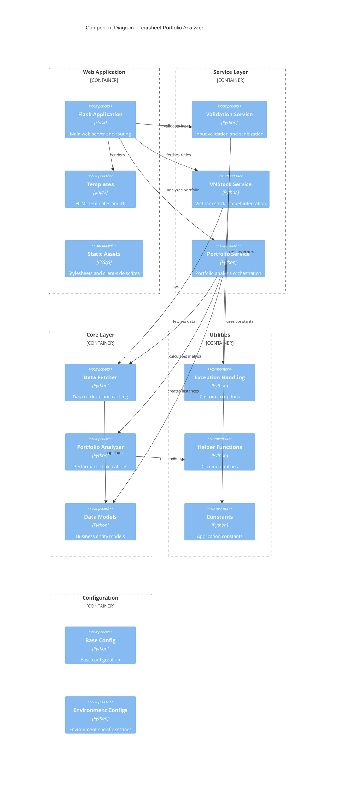

# Component Architecture

## Overview

The Tearsheet Portfolio Analyzer follows a modular, layered architecture with clear separation of concerns. The system is organized into distinct layers and modules to promote maintainability, testability, and scalability.

## Architectural Patterns

### Layered Architecture
- **Presentation Layer**: Web interface and API endpoints
- **Service Layer**: Business logic and orchestration
- **Data Layer**: Data access and external integrations
- **Utilities Layer**: Cross-cutting concerns and helpers

### Dependency Injection
- Service dependencies injected at application startup
- Promotes loose coupling and testability
- Configuration-driven service instantiation

### Repository Pattern
- Abstract data access through service interfaces
- Consistent data access patterns
- Easy mocking for unit tests

## Component Structure

## Layer Details

### Presentation Layer (`app.py` + `templates/`)

#### Flask Application (`app.py`)
- **Responsibilities**:
  - HTTP request handling and routing
  - Request/response processing
  - Error handling and user feedback
  - Session management
  - Static file serving

- **Key Routes**:
  - `GET /` - Portfolio input form
  - `POST /analyze` - Portfolio analysis processing
  - `GET /ratios` - Financial ratios input form
  - `POST /ratios/analyze` - Ratio analysis processing
  - `GET /api/ratios/<symbol>` - JSON API for single symbol ratios

#### Templates (`templates/`)
- **Components**:
  - `index.html` - Portfolio analysis interface
  - `ratios.html` - Financial ratios interface
  - `ratio_results.html` - Ratio analysis results
  - `results.html` - Portfolio analysis results (legacy)

### Service Layer (`src/services/`)

#### Validation Service
- **Purpose**: Input validation and sanitization
- **Key Methods**:
  - `validate_symbols()` - Stock symbol validation
  - `validate_weights()` - Portfolio weight validation
  - `validate_capital()` - Capital amount validation
  - `validate_date_range()` - Date range validation
  - `validate_portfolio_form()` - Complete form validation

#### VNStock Service  
- **Purpose**: Vietnam stock market data integration
- **Key Methods**:
  - `fetch_financial_ratios()` - Individual stock ratios
  - `fetch_multiple_ratios()` - Batch ratio processing
  - `get_fundamental_summary()` - Key metrics summary
  - `export_ratios_to_excel()` - Excel export functionality

### Core Layer (`src/core/`)

#### Data Fetcher
- **Purpose**: Centralized data retrieval and processing
- **Key Methods**:
  - `fetch_historical_data()` - Historical price data
  - `get_close_prices()` - Extract closing prices
  - `validate_data()` - Data quality checks

#### Portfolio Analyzer
- **Purpose**: Portfolio performance calculations
- **Key Methods**:
  - `calculate_portfolio_returns()` - Return calculations
  - `calculate_performance_metrics()` - Risk metrics
  - `validate_portfolio()` - Portfolio validation
  - `get_portfolio_summary()` - Summary statistics

### Data Models (`src/models/`)

#### Stock Model
- **Attributes**: symbol, weight, name, sector
- **Validation**: Weight bounds, symbol format
- **Methods**: Post-initialization validation

#### Portfolio Model
- **Attributes**: stocks, capital, date range, metadata
- **Validation**: Weight sum, date range, capital amount
- **Methods**: Allocation calculation, serialization

#### Portfolio Analysis Model
- **Attributes**: portfolio, returns data, metrics
- **Methods**: Summary statistics, serialization

### Utilities (`src/utils/`)

#### Exception Handling
- **Custom Exceptions**:
  - `ValidationError` - Input validation failures
  - `DataFetchError` - Data retrieval issues
  - `AnalysisError` - Calculation problems
  - `PortfolioError` - Portfolio-specific errors

#### Helper Functions
- **Categories**:
  - Logging setup and configuration
  - Currency and percentage formatting
  - Date calculations and utilities
  - Data structure manipulation

#### Constants
- **Configuration Values**:
  - Validation limits and tolerances
  - Date formats and patterns
  - Error messages and templates
  - Default values and thresholds

## Data Flow

### Portfolio Analysis Flow
1. **Input Validation**: Form data validated by ValidationService
2. **Portfolio Creation**: Portfolio model instantiated with validated data
3. **Data Fetching**: DataFetcher retrieves historical price data
4. **Analysis**: PortfolioAnalyzer calculates performance metrics
5. **Report Generation**: QuantStats generates HTML tearsheet
6. **Response**: User redirected to generated report

### Financial Ratio Analysis Flow
1. **Input Processing**: Symbol list parsed and validated
2. **Data Retrieval**: VNStockService fetches ratio data
3. **Data Processing**: Ratio data formatted and summarized
4. **Export** (optional): Excel export via VNStockService
5. **Results Display**: Ratio results rendered in template

## Configuration Management

### Environment Configuration
- **Base Configuration**: Common settings across environments
- **Development Configuration**: Debug mode, local settings
- **Production Configuration**: Optimized for deployment

### Configuration Loading
- Environment-specific settings loaded at startup
- Environment variables override configuration files
- Validation of required configuration values

## Error Handling Strategy

### Exception Hierarchy
- Base exceptions for different error categories
- Specific exceptions for detailed error classification
- Consistent error messages and user feedback

### Error Boundaries
- Service-level error handling and recovery
- Graceful degradation for non-critical failures
- User-friendly error messages and guidance

## Testing Architecture

### Unit Testing
- Individual component testing
- Mock dependencies for isolation
- Test fixtures for consistent data

### Integration Testing
- Service integration validation
- End-to-end workflow testing
- External API integration testing

### Test Organization
- Test modules mirror source structure
- Shared fixtures and utilities
- Automated test execution pipeline

## Security Considerations

### Input Validation
- Multi-layer validation approach
- SQL injection prevention
- XSS protection measures

### Session Management
- Secure session configuration
- CSRF protection implementation
- Session timeout handling

### Data Privacy
- No permanent storage of sensitive data
- Secure handling of API keys
- Transport layer security enforcement