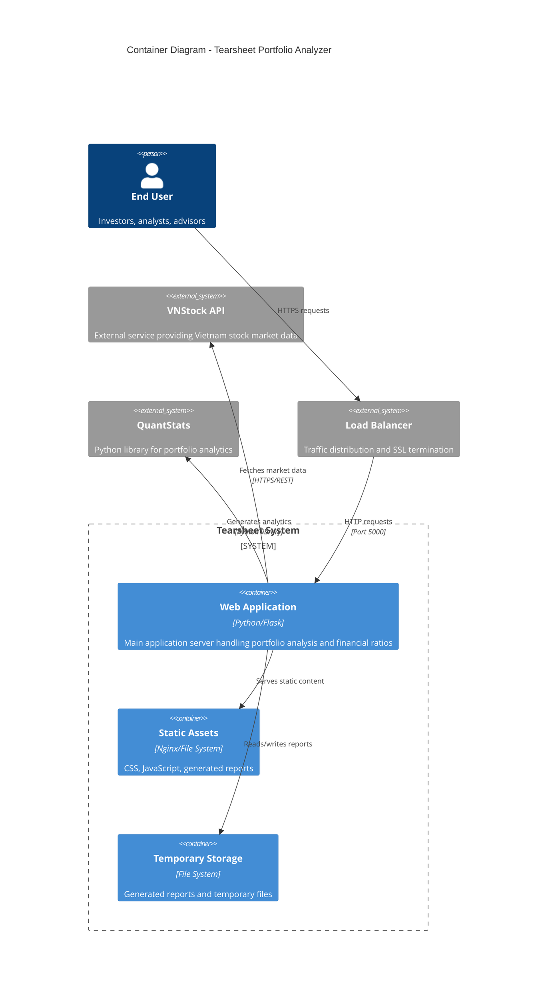

# Container Architecture

## Overview

The Tearsheet Portfolio Analyzer is deployed as a containerized web application designed for both development and production environments. The architecture supports Docker-based deployment with flexible configuration management and scalable infrastructure.

## Container Structure



## Container Details

### Web Application Container

#### Technology Stack
- **Base Image**: Python 3.9+ Alpine Linux
- **Framework**: Flask web framework
- **WSGI Server**: Gunicorn for production
- **Dependencies**: pandas, numpy, quantstats, vnstock, matplotlib

#### Container Configuration
```dockerfile
FROM python:3.9-alpine
WORKDIR /app
COPY requirements.txt .
RUN pip install -r requirements.txt
COPY . .
EXPOSE 5000
CMD ["gunicorn", "app:app", "--bind", "0.0.0.0:5000", "--timeout", "120"]
```

#### Resource Requirements
- **CPU**: 1-2 cores
- **Memory**: 1-2 GB RAM
- **Storage**: 1 GB for application and temporary files
- **Network**: Outbound HTTPS for API calls

### Static Assets Container (Optional)

#### Purpose
- Serve CSS, JavaScript, and image files
- Handle generated HTML reports
- Offload static content from main application

#### Technology
- **Web Server**: Nginx or Apache
- **Caching**: Long-term caching for assets
- **Compression**: Gzip compression enabled

### Deployment Configurations

## Development Environment

### Docker Compose Setup
```yaml
version: '3.8'
services:
  web:
    build: .
    ports:
      - "5000:5000"
    environment:
      - FLASK_ENV=development
      - SECRET_KEY=${SECRET_KEY}
    volumes:
      - .:/app
      - /app/.venv  # Exclude virtual environment
    restart: unless-stopped
  
  nginx:
    image: nginx:alpine
    ports:
      - "80:80"
    volumes:
      - ./nginx.conf:/etc/nginx/nginx.conf
      - ./static:/usr/share/nginx/html/static
    depends_on:
      - web
```

### Development Features
- **Live Reload**: Code changes reflected immediately
- **Debug Mode**: Enhanced error messages and debugging
- **Volume Mounting**: Local development files mounted
- **Environment Variables**: Development-specific configuration

## Production Environment

### Single Container Deployment
```bash
# Build production image
docker build -t tearsheet-analyzer .

# Run with production configuration
docker run -d \
  --name tearsheet-prod \
  -p 5000:5000 \
  -e SECRET_KEY="production-secret" \
  -e PORT=5000 \
  --restart=always \
  tearsheet-analyzer
```

### Container Orchestration (Kubernetes)
```yaml
apiVersion: apps/v1
kind: Deployment
metadata:
  name: tearsheet-deployment
spec:
  replicas: 3
  selector:
    matchLabels:
      app: tearsheet
  template:
    metadata:
      labels:
        app: tearsheet
    spec:
      containers:
      - name: tearsheet
        image: tearsheet-analyzer:latest
        ports:
        - containerPort: 5000
        env:
        - name: SECRET_KEY
          valueFrom:
            secretKeyRef:
              name: tearsheet-secrets
              key: secret-key
        resources:
          requests:
            memory: "512Mi"
            cpu: "250m"
          limits:
            memory: "2Gi"
            cpu: "1000m"
```

## Scaling Strategy

### Horizontal Scaling
- **Stateless Design**: Multiple container instances
- **Load Balancing**: Distribute traffic across instances
- **Session Management**: No server-side session state
- **Shared Storage**: Optional shared volume for reports

### Vertical Scaling
- **CPU Scaling**: Increase processing power for calculations
- **Memory Scaling**: Handle larger datasets and concurrent users
- **I/O Optimization**: SSD storage for temporary files

## Configuration Management

### Environment Variables
```bash
# Application Configuration
SECRET_KEY=your-secret-key-here
PORT=5000
FLASK_ENV=production

# External API Configuration  
VNSTOCK_API_URL=https://api.vnstock.com
VNSTOCK_API_KEY=your-api-key

# Performance Tuning
GUNICORN_WORKERS=4
GUNICORN_TIMEOUT=120
MAX_CONTENT_LENGTH=16777216  # 16MB
```

### Configuration Layers
1. **Base Configuration**: Default values in `config/base.py`
2. **Environment Configuration**: Environment-specific overrides
3. **Runtime Configuration**: Environment variables and secrets
4. **Feature Flags**: Runtime feature toggles

## Security Considerations

### Container Security
- **Non-root User**: Run application as non-privileged user
- **Minimal Base Image**: Alpine Linux for smaller attack surface
- **Dependency Scanning**: Regular security updates
- **Secrets Management**: External secret management system

### Network Security
- **HTTPS Only**: SSL/TLS encryption in production
- **Network Policies**: Restrict container-to-container communication
- **API Security**: Rate limiting and authentication for external APIs
- **CORS Policy**: Cross-origin request restrictions

## Monitoring and Observability

### Health Checks
```python
@app.route('/health')
def health_check():
    return {'status': 'healthy', 'timestamp': datetime.now().isoformat()}
```

### Container Metrics
- **CPU Usage**: Monitor processing load
- **Memory Usage**: Track memory consumption
- **Network I/O**: External API call monitoring
- **Disk Usage**: Temporary file storage monitoring

### Logging Strategy
- **Structured Logging**: JSON format for log aggregation
- **Log Levels**: Configurable logging levels
- **External Logging**: Ship logs to external systems
- **Error Tracking**: Application error monitoring

## Deployment Strategies

### Blue-Green Deployment
- **Zero Downtime**: Seamless version updates
- **Rollback Capability**: Quick rollback to previous version
- **Testing**: Validate new version before traffic switch

### Rolling Updates
- **Kubernetes Native**: Built-in rolling update support
- **Gradual Rollout**: Reduce deployment risk
- **Health Checks**: Automated health validation

### Canary Deployment
- **Traffic Splitting**: Route percentage of traffic to new version
- **Monitoring**: Monitor metrics during rollout
- **Automated Rollback**: Rollback on error thresholds

## Disaster Recovery

### Backup Strategy
- **Application Code**: Version control (Git)
- **Configuration**: Infrastructure as code
- **No Data Backup**: Stateless architecture

### Recovery Procedures
- **Container Recreation**: Restart failed containers
- **Multi-Region**: Deploy across multiple availability zones
- **External Dependencies**: Monitor and failover for API services

## Performance Optimization

### Container Optimization
- **Image Size**: Multi-stage builds to reduce image size
- **Layer Caching**: Optimize Dockerfile for build caching
- **Resource Limits**: Appropriate resource allocation

### Application Optimization
- **Connection Pooling**: Reuse HTTP connections
- **Caching**: In-memory caching for frequently accessed data
- **Asynchronous Processing**: Non-blocking I/O where possible