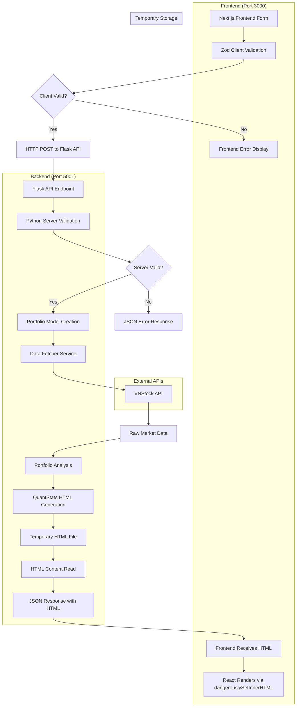

# Data Architecture

## Overview

The Tearsheet Portfolio Analyzer follows a modern **microservices data architecture** where data flows from external sources through a Flask API backend to generate QuantStats HTML tearsheets for display in a Next.js frontend. The system maintains a stateless approach with no persistent storage, emphasizing real-time data processing and HTML generation.

## Data Sources

### Primary Data Sources

#### VNStock API
- **Type**: External REST API
- **Provider**: Vietnam stock market data provider
- **Data Types**:
  - Historical stock prices (OHLCV data)
  - Financial ratios (profitability, liquidity, leverage)
  - Company fundamentals (market cap, P/E, P/B ratios)
  - Corporate information and metadata

- **Access Pattern**: On-demand HTTP requests
- **Rate Limits**: API-dependent throttling
- **Data Format**: JSON responses
- **Reliability**: High availability with error handling

#### QuantStats Library
- **Type**: Embedded Python library
- **Purpose**: Portfolio analytics and visualization
- **Functionality**:
  - Performance metric calculations
  - Risk analysis algorithms
  - Chart and report generation
  - Benchmark comparisons

## Data Flow Architecture



## Data Models

### Frontend Data Models (TypeScript)

#### Portfolio Form Data
```typescript
interface PortfolioFormData {
  symbols: string[];      // Stock ticker symbols
  weights: number[];      // Portfolio allocation weights
  capital: number;        // Initial investment amount
  start_date: string;     // Analysis start date (YYYY-MM-DD)
  end_date: string;       // Analysis end date (YYYY-MM-DD)
  name?: string;          // Portfolio identifier
}
```

#### Tearsheet Response
```typescript
interface TearsheetResponse {
  html: string;           // Complete QuantStats HTML content
  portfolio_name: string; // Portfolio identifier
  symbols: string[];      // List of stock symbols
  period: string;         // Analysis period description
  data_points: number;    // Number of data points analyzed
}
```

### Backend Data Models (Python)

#### Stock Model
```python
@dataclass
class Stock:
    symbol: str          # Stock ticker symbol (e.g., "REE", "FMC")
    weight: float        # Portfolio allocation weight (0.0 - 1.0)
    name: Optional[str]  # Company name
    sector: Optional[str] # Business sector
```

**Validation Rules**:
- Symbol: 3-4 uppercase characters, Vietnam stock format
- Weight: Between 0.0 and 1.0
- Total portfolio weights must sum to 1.0

#### Portfolio Model
```python
@dataclass
class Portfolio:
    stocks: List[Stock]           # List of portfolio holdings
    capital: float               # Initial investment amount
    start_date: str             # Analysis start date (YYYY-MM-DD)
    end_date: str               # Analysis end date (YYYY-MM-DD)
    name: Optional[str] = None  # Portfolio identifier
    created_at: datetime        # Creation timestamp
```

**Business Rules**:
- Minimum 1 stock, maximum 50 stocks per portfolio
- Capital must be positive
- Date range: maximum 10 years, start < end
- End date cannot be in the future

### Data Transformation Pipeline

#### 1. Frontend Data Processing
- **Source**: React form inputs (PortfolioForm.tsx)
- **Processing**: 
  - Zod schema validation
  - TypeScript type enforcement
  - Real-time form validation feedback
- **Output**: Validated PortfolioFormData objects

#### 2. API Data Transmission
- **Source**: Frontend validated data
- **Processing**:
  - JSON serialization
  - HTTP POST to `/api/tearsheet` endpoint
  - Axios request configuration and error handling
- **Output**: HTTP request to Flask backend

#### 3. Backend Data Processing
- **Source**: JSON API requests
- **Processing**:
  - Python validation service
  - Portfolio model instantiation
  - Data type conversion and normalization
- **Output**: Validated Python data structures

#### 4. Historical Data Retrieval
- **Source**: VNStock API responses
- **Processing**:
  - JSON parsing and extraction
  - Date range filtering
  - Missing data handling
  - Pandas DataFrame creation
- **Output**: Structured market data

#### 5. QuantStats HTML Generation
- **Input**: Portfolio returns and configuration
- **Processing**:
  - Complete tearsheet generation via `qs.reports.html()`
  - Temporary file creation and management
  - HTML content extraction
- **Output**: Complete HTML tearsheet content

#### 6. Frontend HTML Rendering
- **Input**: JSON response with HTML content
- **Processing**:
  - TanStack Query state management
  - React component rendering
  - HTML injection via `dangerouslySetInnerHTML`
- **Output**: Displayed QuantStats tearsheet

## Data Quality and Validation

### Input Validation Strategy
- **Multi-layer validation**: Client-side + server-side + business logic
- **Validation Service**: Centralized validation rules
- **Error Categories**:
  - Format validation (date formats, numeric ranges)
  - Business rule validation (weight constraints, date logic)
  - Data integrity validation (symbol existence, market hours)

### Data Quality Checks
- **Missing Data Handling**:
  - Forward fill for minor gaps
  - Error reporting for significant gaps
  - Alternative data source failover
  
- **Outlier Detection**:
  - Statistical outlier identification
  - Price spike detection and filtering
  - Volume anomaly detection

### Error Handling
- **Graceful Degradation**: Partial results when possible
- **User Feedback**: Clear error messages and guidance
- **Logging**: Comprehensive error tracking and monitoring

## Data Processing Patterns

### Batch Processing
- **Portfolio Analysis**: Process entire date range at once
- **Multiple Stock Ratios**: Batch API requests for efficiency
- **Report Generation**: Aggregate processing for final output

### Stream Processing
- **Real-time Validation**: Immediate feedback on form inputs
- **Progressive Enhancement**: Incremental UI updates
- **Caching Strategy**: In-memory caching for repeated requests

### Data Aggregation
- **Portfolio Metrics**: Weighted aggregation across holdings
- **Time Series Aggregation**: Daily, monthly, yearly summaries
- **Cross-sectional Analysis**: Sector and market comparisons

## Caching and Performance

### Caching Strategy
- **Frontend Caching**: TanStack Query automatic API response caching
- **No Persistent Storage**: Stateless microservices architecture
- **Temporary File Management**: HTML tearsheets cleaned up after response
- **CDN Integration**: Next.js automatic static asset optimization

### Performance Optimization
- **Server-Side Rendering**: Next.js App Router for improved performance
- **API Optimization**: Efficient Flask API with minimal overhead
- **Bundle Optimization**: Next.js Turbopack for faster builds
- **QuantStats Native**: Leveraging proven tearsheet generation instead of custom charts

## Data Security and Privacy

### Data Handling Principles
- **No Persistent Storage**: No permanent storage of user data
- **In-Memory Processing**: Data exists only during request lifecycle
- **Secure Transmission**: HTTPS for all external API communications
- **Input Sanitization**: XSS and injection attack prevention

### Data Privacy Measures
- **No Personal Data Storage**: Portfolio data not permanently stored
- **Session Isolation**: User sessions completely isolated
- **Temporary File Cleanup**: Generated reports cleaned up regularly
- **API Key Security**: External API credentials securely managed

## External Data Dependencies

### VNStock API Integration
- **Connection Management**: HTTP connection pooling
- **Retry Logic**: Exponential backoff for failed requests
- **Rate Limiting**: Respect API usage limits
- **Failover Strategy**: Error handling and user notification

### Data Format Standards
- **Date Format**: ISO 8601 (YYYY-MM-DD)
- **Number Format**: Decimal precision for financial calculations
- **Currency**: Vietnamese Dong (VND) with proper formatting
- **Percentage**: Decimal representation (0.05 = 5%)

## Data Lineage and Traceability

### Data Provenance
- **Source Tracking**: All data traced to original source
- **Transformation Log**: Record of all data processing steps
- **Calculation Audit Trail**: Detailed calculation methodology
- **Version Control**: Track changes to analysis algorithms

### Quality Metrics
- **Data Freshness**: Timestamp of last data update
- **Completeness**: Percentage of available data points
- **Accuracy**: Validation against known benchmarks
- **Consistency**: Cross-validation between data sources