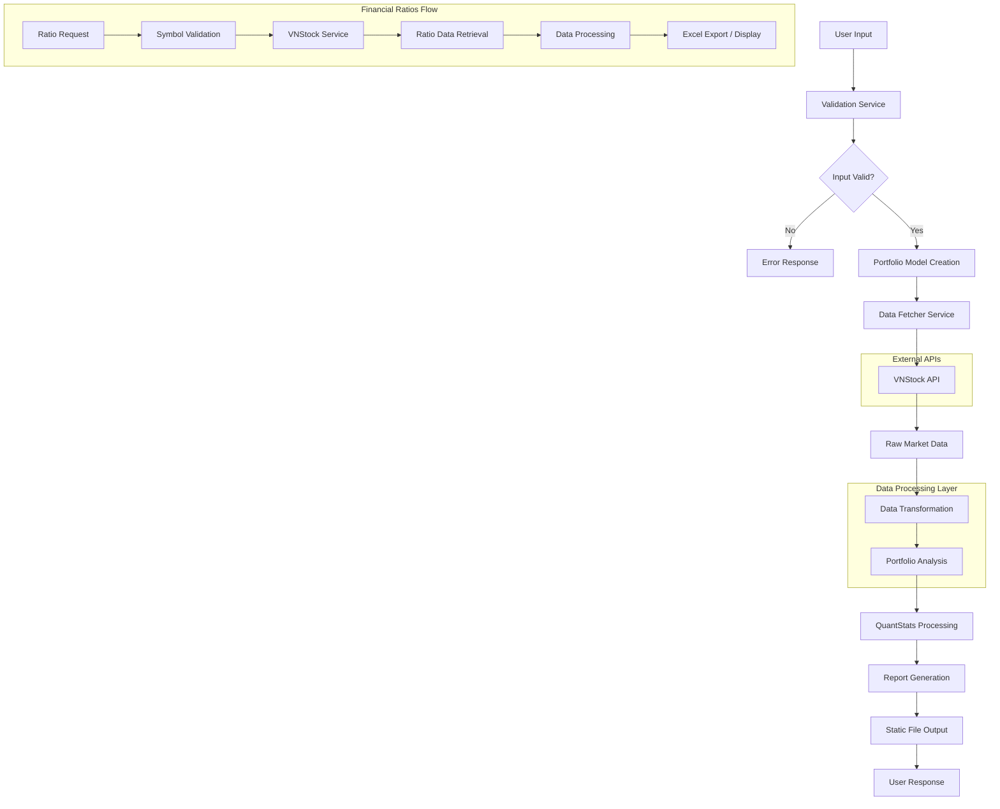

# Data Architecture

## Overview

The Tearsheet Portfolio Analyzer follows a stateless, data-driven architecture where data flows from external sources through processing layers to generate analytical reports. The system does not maintain persistent storage, instead relying on real-time data retrieval and in-memory processing.

## Data Sources

### Primary Data Sources

#### VNStock API
- **Type**: External REST API
- **Provider**: Vietnam stock market data provider
- **Data Types**:
  - Historical stock prices (OHLCV data)
  - Financial ratios (profitability, liquidity, leverage)
  - Company fundamentals (market cap, P/E, P/B ratios)
  - Corporate information and metadata

- **Access Pattern**: On-demand HTTP requests
- **Rate Limits**: API-dependent throttling
- **Data Format**: JSON responses
- **Reliability**: High availability with error handling

#### QuantStats Library
- **Type**: Embedded Python library
- **Purpose**: Portfolio analytics and visualization
- **Functionality**:
  - Performance metric calculations
  - Risk analysis algorithms
  - Chart and report generation
  - Benchmark comparisons

## Data Flow Architecture



## Data Models

### Core Data Models

#### Stock Model
```python
@dataclass
class Stock:
    symbol: str          # Stock ticker symbol (e.g., "REE", "FMC")
    weight: float        # Portfolio allocation weight (0.0 - 1.0)
    name: Optional[str]  # Company name
    sector: Optional[str] # Business sector
```

**Validation Rules**:
- Symbol: 3-4 uppercase characters, Vietnam stock format
- Weight: Between 0.0 and 1.0
- Total portfolio weights must sum to 1.0

#### Portfolio Model
```python
@dataclass
class Portfolio:
    stocks: List[Stock]           # List of portfolio holdings
    capital: float               # Initial investment amount
    start_date: str             # Analysis start date (YYYY-MM-DD)
    end_date: str               # Analysis end date (YYYY-MM-DD)
    name: Optional[str] = None  # Portfolio identifier
    created_at: datetime        # Creation timestamp
```

**Business Rules**:
- Minimum 1 stock, maximum 50 stocks per portfolio
- Capital must be positive
- Date range: maximum 10 years, start < end
- End date cannot be in the future

#### Portfolio Analysis Model
```python
@dataclass
class PortfolioAnalysis:
    portfolio: Portfolio              # Original portfolio
    returns_data: pd.Series          # Time series of portfolio returns
    metrics: Dict[str, float]        # Performance metrics
    individual_returns: Optional[pd.DataFrame]  # Individual stock returns
    analysis_timestamp: datetime     # Analysis execution time
```

### Data Transformation Pipeline

#### 1. Input Data Processing
- **Source**: HTML form data or API requests
- **Processing**: 
  - String cleaning and normalization
  - Type conversion (strings to floats/dates)
  - Input validation and sanitization
- **Output**: Validated data objects

#### 2. Historical Data Retrieval
- **Source**: VNStock API responses
- **Processing**:
  - JSON parsing and extraction
  - Date range filtering
  - Missing data handling
  - Column standardization
- **Output**: Pandas DataFrame with OHLCV data

#### 3. Portfolio Return Calculation
- **Input**: Price data + portfolio weights
- **Processing**:
  - Daily return calculation: `(price_t - price_t-1) / price_t-1`
  - Weighted portfolio returns: `sum(weight_i * return_i)`
  - Cumulative return aggregation
- **Output**: Portfolio return time series

#### 4. Performance Metrics Calculation
- **Calculations**:
  - Total Return: `(final_value - initial_value) / initial_value`
  - Volatility: Standard deviation of returns (annualized)
  - Sharpe Ratio: `(return - risk_free_rate) / volatility`
  - Maximum Drawdown: Largest peak-to-trough decline
  - Win Rate: Percentage of positive return periods

## Data Quality and Validation

### Input Validation Strategy
- **Multi-layer validation**: Client-side + server-side + business logic
- **Validation Service**: Centralized validation rules
- **Error Categories**:
  - Format validation (date formats, numeric ranges)
  - Business rule validation (weight constraints, date logic)
  - Data integrity validation (symbol existence, market hours)

### Data Quality Checks
- **Missing Data Handling**:
  - Forward fill for minor gaps
  - Error reporting for significant gaps
  - Alternative data source failover
  
- **Outlier Detection**:
  - Statistical outlier identification
  - Price spike detection and filtering
  - Volume anomaly detection

### Error Handling
- **Graceful Degradation**: Partial results when possible
- **User Feedback**: Clear error messages and guidance
- **Logging**: Comprehensive error tracking and monitoring

## Data Processing Patterns

### Batch Processing
- **Portfolio Analysis**: Process entire date range at once
- **Multiple Stock Ratios**: Batch API requests for efficiency
- **Report Generation**: Aggregate processing for final output

### Stream Processing
- **Real-time Validation**: Immediate feedback on form inputs
- **Progressive Enhancement**: Incremental UI updates
- **Caching Strategy**: In-memory caching for repeated requests

### Data Aggregation
- **Portfolio Metrics**: Weighted aggregation across holdings
- **Time Series Aggregation**: Daily, monthly, yearly summaries
- **Cross-sectional Analysis**: Sector and market comparisons

## Caching and Performance

### Caching Strategy
- **No Persistent Storage**: Stateless architecture
- **Session-based Caching**: Temporary data during user session
- **API Response Caching**: Short-term caching of external API calls
- **Static Asset Caching**: Long-term caching of CSS/JS/images

### Performance Optimization
- **Lazy Loading**: Load data only when needed
- **Batch API Requests**: Minimize external API calls
- **Efficient Data Structures**: Pandas optimization for numerical data
- **Parallel Processing**: Concurrent data fetching where possible

## Data Security and Privacy

### Data Handling Principles
- **No Persistent Storage**: No permanent storage of user data
- **In-Memory Processing**: Data exists only during request lifecycle
- **Secure Transmission**: HTTPS for all external API communications
- **Input Sanitization**: XSS and injection attack prevention

### Data Privacy Measures
- **No Personal Data Storage**: Portfolio data not permanently stored
- **Session Isolation**: User sessions completely isolated
- **Temporary File Cleanup**: Generated reports cleaned up regularly
- **API Key Security**: External API credentials securely managed

## External Data Dependencies

### VNStock API Integration
- **Connection Management**: HTTP connection pooling
- **Retry Logic**: Exponential backoff for failed requests
- **Rate Limiting**: Respect API usage limits
- **Failover Strategy**: Error handling and user notification

### Data Format Standards
- **Date Format**: ISO 8601 (YYYY-MM-DD)
- **Number Format**: Decimal precision for financial calculations
- **Currency**: Vietnamese Dong (VND) with proper formatting
- **Percentage**: Decimal representation (0.05 = 5%)

## Data Lineage and Traceability

### Data Provenance
- **Source Tracking**: All data traced to original source
- **Transformation Log**: Record of all data processing steps
- **Calculation Audit Trail**: Detailed calculation methodology
- **Version Control**: Track changes to analysis algorithms

### Quality Metrics
- **Data Freshness**: Timestamp of last data update
- **Completeness**: Percentage of available data points
- **Accuracy**: Validation against known benchmarks
- **Consistency**: Cross-validation between data sources