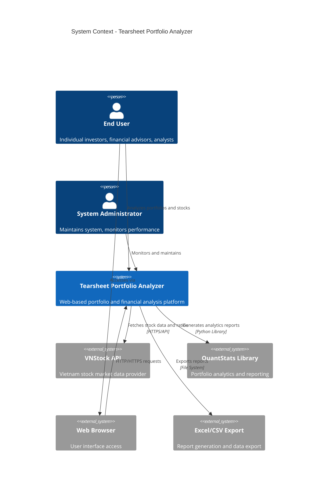

# System Context

## Overview

The Tearsheet Portfolio Analyzer is a web-based financial analysis application that provides portfolio performance analysis and financial ratio analysis for Vietnam stock market securities. It enables users to analyze portfolio performance using QuantStats and examine detailed financial ratios using the vnstock API.

## System Purpose and Scope

### Primary Functions
- **Portfolio Analysis**: Calculate portfolio returns, risk metrics, and generate comprehensive tearsheet reports
- **Financial Ratio Analysis**: Analyze fundamental financial metrics for Vietnamese securities
- **Data Visualization**: Interactive charts, heatmaps, and performance dashboards
- **Export Capabilities**: Generate Excel reports and HTML tearsheets

### Target Users
- **Individual Investors**: Personal portfolio analysis and stock research
- **Financial Advisors**: Client portfolio reporting and analysis
- **Research Analysts**: Fundamental analysis of Vietnamese securities
- **Portfolio Managers**: Performance tracking and risk assessment

## System Context Diagram

## External Systems and Integrations

### VNStock API Integration
- **Purpose**: Primary source for Vietnam stock market data
- **Data Types**: Historical prices, financial ratios, company fundamentals
- **Protocol**: HTTP REST API
- **Reliability**: High availability, rate-limited
- **Authentication**: API key-based (when required)

### QuantStats Library
- **Purpose**: Portfolio performance analytics and reporting
- **Functionality**: Risk metrics, return analysis, benchmark comparison
- **Integration**: Python library dependency
- **Output Formats**: HTML reports, PNG/SVG charts

### Web Browser Interface
- **Technologies**: HTML5, CSS3, JavaScript, Bootstrap
- **Compatibility**: Modern browsers (Chrome, Firefox, Safari, Edge)
- **Responsiveness**: Mobile and desktop optimized
- **Security**: HTTPS recommended for production

### File System Integration
- **Static Reports**: HTML tearsheet generation
- **Export Files**: Excel/CSV financial ratio exports
- **Asset Storage**: CSS, JavaScript, and image assets
- **Logging**: Application and error logs

## System Boundaries

### Internal Scope
- Web application server and business logic
- Data validation and processing
- Report generation and visualization
- User session management
- Configuration management

### External Dependencies
- Vietnam stock market data availability
- Third-party library compatibility
- Web browser capabilities
- Network connectivity requirements

## Quality Attributes

### Performance
- **Response Time**: < 2 seconds for portfolio analysis
- **Throughput**: Support for concurrent users
- **Scalability**: Horizontal scaling capability

### Reliability
- **Availability**: 99.5% uptime target
- **Error Handling**: Graceful degradation
- **Data Integrity**: Validation at all input points

### Security
- **Authentication**: Session-based security
- **Input Validation**: SQL injection and XSS prevention
- **Data Privacy**: No sensitive financial data storage
- **Transport Security**: HTTPS encryption

### Maintainability
- **Modular Architecture**: Separation of concerns
- **Code Quality**: Automated formatting and linting
- **Documentation**: Comprehensive API and architecture docs
- **Testing**: Unit, integration, and end-to-end tests

## Constraints and Assumptions

### Technical Constraints
- Python 3.9+ runtime requirement
- Flask web framework dependency
- VNStock API rate limits and availability
- Server-side rendering for chart generation

### Business Constraints
- Vietnam stock market data focus
- Free tier usage limitations
- Regulatory compliance requirements

### Assumptions
- Stable internet connectivity for API access
- Modern web browser usage
- English/Vietnamese language support
- Single-tenant deployment model